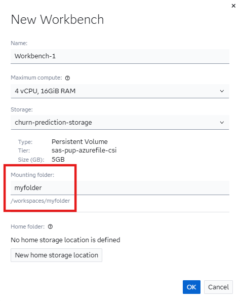

# :fire: Predicting customer churn in the energy sector with SAS Viya Workbench

Customer churn is a major challenge for energy providers, directly impacting revenue and long-term business stability. This project aims to develop a churn prediction model to help energy companies proactively identify at-risk customers and implement targeted retention strategies. The dataset we used can be found [here](https://www.kaggle.com/datasets/erolmasimov/powerco). It is a Kaggle dataset that provides insights into Small and Medium Enterprises (SMEs) served by the PowerCO energy supplier.

The goal is to build and evaluate machine learning models using both **[scikit-learn](https://scikit-learn.org/stable/index.html)** and the **[SAS Python API](https://go.documentation.sas.com/doc/en/workbenchcdc/v_001/vwbpymlpg/titlepage.htm)** available in **[SAS Viya Workbench](https://go.documentation.sas.com/doc/en/workbenchcdc/v_001/workbenchwlcm/home.htm)**, which enables users to leverage SAS analytics within Python workflows. The best-performing model is selected using a hyperparameter tuning procedure, and a final cutoff optimization step is performed to maximize business impact from the retention campaign.

# :pushpin: Project Overview

In this project, we:

- Load and preprocess customer and price data.
- Perform feature engineering and exploratory data analysis (EDA).
- Train and evaluate machine learning models to predict the churn likelihood of each customer.
- Compare model performance using AUC score and cross-validation.
- Optimize model hyperparameters using [Optuna](https://optuna.org/).
- Determine the optimal probability cutoff for maximizing retention campaign effectiveness.

# :open_file_folder: Repository Structure
- `data` folder: It contains raw and processed datasets used and generated throughout the project.
- `img` folder: It stores images used in the project files.
- Three Jupyter Notebooks guiding the full churn prediction pipeline (data cleaning, data preparation, model training/evaluation, and cutoff optimization).
- `utils.py` and `model_building_utils.py`: Python utility scripts for preprocessing, data visualization, data preparation, and model training.
- `requirements.txt`: It lists all required Python packages for this project.
- `requirements_short.txt`: It specifies only the Python packages that need to be additionally installed in SAS Viya Workbench for this project.

# :wrench: Setup Instructions

To ensure the project works properly, we recommend creating a dedicated storage location in SAS Viya Workbench to separate the different Python dependencies required for various projects. To do so, follow the steps outlined in the [documentation](https://go.documentation.sas.com/doc/en/workbenchcdc/v_001/workbenchgs/p1oa82y6hbc2vfn1po8y224qxwx9.htm). Next, when creating the workbench for the project (click [here](https://go.documentation.sas.com/doc/en/workbenchcdc/v_001/workbenchgs/n1fvzggnvda7v1n19e171jg5ug7i.htm) for the procedure), select the storage location you just created and rename the mounting folder to `myfolder`:

<div align="center">
  
</div>

This is recommended because each notebook defines a `repo_path` variable at the beginning, which assumes that the mounting folder is named `myfolder`. However, if you prefer, you can modify the `repo_path` variable to match your desired mounting folder path.

Once the workbench has been set up, you can open it in your IDE of choice (Visual Studio Code, Jupyter Notebook, or Jupyter Lab), then clone this repository by running the following command in the terminal:
```
git clone https://github.com/Mat-Gug/energy-churn-prediction.git
``` 
Finally, navigate to the repository's root folder and install the required Python dependencies:
```
cd /path/to/repository
pip install -r requirements_short.txt
```

# :notebook_with_decorative_cover: Notebooks

## Churn Prediction - Part 1: Data Cleaning

This notebook focuses on loading and preprocessing the dataset to ensure data consistency and quality before model training. The key steps include:

1. **Date Handling**: Converting date columns to datetime format and ensuring valid date sequences.
2. **Feature Mapping**: Replacing hashed categorical values with more human-readable labels.
3. **Data Cleaning**: This involves several data quality checks.
    - Removing duplicate rows.
    - Checking for negative values in some numeric columns.
    - Ensuring data consistency for features like `has_gas` and `cons_gas_12m`.
    - Identifying and handling invalid date sequences.
    - Verifying margin constraints for energy pricing.
    
    All these potential redundant or inconsistent rows are saved to separate csv files for further investigation, if needed.
4. **Missing Value Analysis**: Reporting and saving columns with missing values.
5. **Saving Cleaned Data**: Exporting processed data for further analysis.

This notebook establishes a clean dataset, preparing it for feature engineering and model building in the next steps.

## Churn Prediction - Part 2: Data Preparation

This notebook processes and prepares client and price data for churn prediction analysis by handling missing values, feature engineering, and data transformations. The key steps are:

1. **Data Exploration for the cleaned `price_data` table**: This involves counting unique IDs, examining distinct values in the `price_date` variable, and plotting the number of price records per client. 
2. **Handling Missing Data**: From the previous step, clients with incomplete price records (fewer than 12 months of data) are identified. Therefore, these missing values are imputed using median monthly prices.
3. **Feature Engineering for Price Data**: Summary statistics (mean, median, min, max, standard deviation, max difference between consecutive months) are computed for each client’s price variables. This allows us to then merge the price data with client data.
4. **Feature Engineering for Client Data and saving a first version of the data**: Before dropping date columns, relevant features are extracted (e.g., whether a product was modified, contract age at last modification, days remaining until contract end). After doing that, a first version of the dataset is saved to the `merged_data_no_tfm.csv` file.
5. **Data Transformations**:
    - Some low cardinality numeric variables (`nb_prod_act`, `num_years_antig`, `forecast_discount_energy`) are converted into categorical variables, grouping rare values.
    - Highly skewed numerical variables are transformed using square or log transformations.
    - Numerical columns with many zero values are transformed as follows:
        - A binary flag variable is created to indicate whether a value is in the spike (0) or in the distribution (non-zero).
        - A new variable is derived from the original one, where non-zero values are retained, and zeros are set to missing. If this variable exhibits high skewness, a log or square transformation is applied to the non-missing values. Missing values will be imputed during the Model Building phase.
6. **Correlation Analysis and Feature Selection**: A correlation matrix is plotted for both the non-transformed and transformed versions of the dataset. Redundant variables are then removed to prevent multicollinearity, reduce overfitting, and enhance model interpretability.
7. **Saving Processed Data**: The non-transformed and transformed datasets are saved as separate CSV files for use in the next phase of the project.

## Churn Prediction - Part 3: Model Training, Evaluation, an Cutoff Optimization

This notebook focuses on training and evaluating multiple machine learning models for churn prediction using both `sasviya` and `scikit-learn` libraries. It also includes hyperparameter optimization using **Optuna** to find the best-performing model. The key steps are:
1. **Model Training and Evaluation (Non-Transformed Data)**:  Logistic Regression, Decision Tree, Random Forest, and Gradient Boosting models are trained using both `sasviya` and `scikit-learn`, implementing cross-validation for model evaluation. Then, the trained models are compared based on AUC scores for an initial assessment of the two libraries.
2. **Hyperparameter Optimization with Optuna (Non-Transformed Data)**: An Optuna study is run with multiple trials to maximize model performance based on AUC score on the validation set, implementing also in this case cross-validation. Finally, the best-performing model is selected and re-trained on the full training set.
3. **Model Training and Hyperparameter Optimization (Transformed Data)**: The same training and evaluation process is repeated using the transformed dataset to determine which preprocessing approach yields the best performance.
4. **Model Selection and Cutoff optimization**: After choosing the best model from the previous steps, a cutoff optimization for a retention campaign is performed, consisting of the following steps:
    - Choose the discount rate and the expected retention efficiency of the discount.
    - Determine the optimal probability threshold to maximize annual profit by balancing prevented churn losses against the cost of offering discounts.

To sum up, the key features of this last notebook are:
- Comparison of `sasviya` and `scikit-learn` models.
- Automated hyperparameter tuning with Optuna.
- Cross-validation for model evaluation.
- Cutoff optimization for identifying customers to target with a retention campaign.